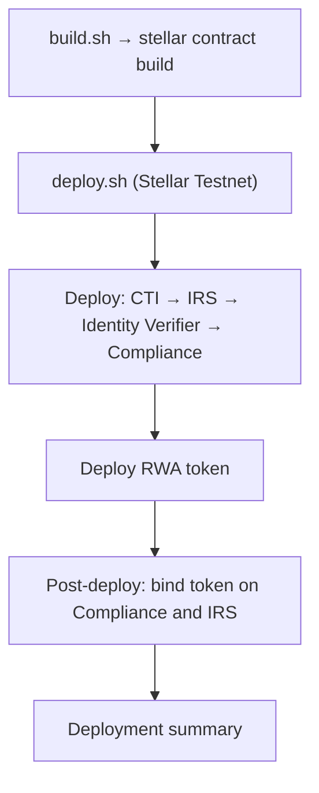

# [preview] Token name ([preview])

> Generated by [@openzeppelin/codegen-rwa-stellar](https://www.npmjs.com/package/@openzeppelin/codegen-rwa-stellar)

## Prerequisites

- [Rust](https://www.rust-lang.org/tools/install) toolchain (edition 2021)
- [Stellar CLI](https://developers.stellar.org/docs/tools/developer-tools/cli/install-cli) (`stellar` command)
- `soroban-sdk` version: `26.1.0`
- `wasm32v1-none` target: `rustup target add wasm32v1-none`
- Funded Stellar account on the target network for the deploy signer
- Ensure Stellar CLI knows the testnet profile (`stellar network ls`). Fund the deploy signer on testnet (`stellar keys generate <name> --fund`).

## Build

Compile all contracts in the workspace (required before deploy):

```bash
chmod +x scripts/build.sh
./scripts/build.sh
```

`build.sh` compiles **7** WASM artifacts: **5** deployed by `deploy.sh`, plus **2** example/dev-only crates (`rwa_claim_issuer_example.wasm`, `rwa_identity_example.wasm`). Preflight validates only the 5 deployable artifacts.

After building, run `cargo fmt` to apply canonical Rust formatting to the generated source files.

## Deploy

Deploy all contracts to Stellar Testnet:

### Quick start

Before running `deploy.sh`, set a signable Stellar CLI source account. The script resolves
`SOURCE_ACCOUNT` first and falls back to `STELLAR_ACCOUNT`.

**Configured addresses for this project**

- **Admin:** `[preview] owner address`
- **Manager:** `[preview] owner address`

The chosen identity must control these addresses — post-deploy configuration signs with the Manager role (and Admin for admin-gated invokes). If you do not control the configured Admin address, regenerate the project in the wizard with an address from `stellar keys address <your-identity>`.

```bash
# Prerequisites: Rust, Stellar CLI, wasm32v1-none target
rustup target add wasm32v1-none

# Admin for this project: [preview] owner address
# Use a CLI identity you already control whose G-address matches Admin.
# stellar keys generate always creates a new random address — it will not match the
# preconfigured Admin unless you regenerated this project with that address in the wizard.
stellar keys address <your-identity>   # must output [preview] owner address

# Build, then deploy
chmod +x scripts/build.sh scripts/deploy.sh
./scripts/build.sh
cargo fmt

export STELLAR_ACCOUNT=<your-identity>
./scripts/deploy.sh --preflight   # optional: validate signers + WASM without deploying
./scripts/deploy.sh
```

Run `./scripts/deploy.sh --preflight` to validate signers and WASM artifacts without spending XLM on deployment.

### Configured access control

These addresses are embedded in `scripts/deploy.sh` at generation time:

| Role | Address | Deploy signer env var | Notes |
|------|---------|-------------------------|-------|
| Admin | `[preview] owner address` | ADMIN_SOURCE_ACCOUNT (defaults to SOURCE_ACCOUNT) |  |
| Manager (deploy/post-deploy) | `[preview] owner address` | MANAGER_SOURCE_ACCOUNT (defaults to SOURCE_ACCOUNT) | Same as Admin in this project. |

### End-to-end script flow

`build.sh` compiles the workspace; `deploy.sh` deploys contracts and runs post-deploy configuration. The following diagram is generated from this project's config and matches the script order:

### Troubleshooting

| Symptom | Likely cause | Fix |
|---------|--------------|-----|
| `Missing signing key for [preview] owner address` (or Manager) during post-deploy | `STELLAR_ACCOUNT` identity does not control Admin/Manager | `stellar keys address <identity>` must match the configured role address, or regenerate with your own address |
| `Admin signer mismatch` / `Manager signer mismatch` at start | CLI identity resolves to a different G-address | Export the identity that controls the configured address, or update Admin/Manager in the wizard and regenerate |
| `Missing target/wasm32v1-none/release/*.wasm` | Build step skipped | Run `./scripts/build.sh` before `./scripts/deploy.sh` |
| `Missing Stellar source account` | Neither `SOURCE_ACCOUNT` nor `STELLAR_ACCOUNT` is set | `export STELLAR_ACCOUNT=<your-cli-identity>` |
| Contracts deployed but script failed mid post-deploy | No resume support yet | Note addresses from the terminal output or `deployment-manifest.json` if written; redeploy to a fresh workspace or complete remaining invokes manually |
| Insufficient balance errors | Deploy signer unfunded | Fund on testnet: `stellar keys generate <name> --fund` |

The deploy script handles the complete lifecycle:
1. Validates deploy signers and WASM artifacts (use `--preflight` to stop after validation)
2. Deploys contracts in dependency order
3. Captures deployed contract addresses
4. Performs post-deployment configuration (token binding, module registration, claim topics, trusted issuers)
5. Writes `deployment-manifest.json` with deployed addresses





`config.json` is an informational snapshot of the exact source config used to generate this project. You can reuse it to regenerate or re-import the project later, but `deploy.sh` does not read it at runtime.

## Architecture

This is a multi-contract Stellar/Soroban system implementing a Real World Asset (RWA) token with identity verification and compliance enforcement.

The system follows a modular architecture where each concern is handled by a dedicated contract:

- **RWA Token** — The primary asset token with built-in transfer restrictions
- **Compliance** — Pluggable compliance engine that validates transfers against registered modules
- **Identity Verifier** — Verifies that token holders have valid identity claims
- **Claim Topics & Issuers (CTI)** — Registry of trusted claim issuers and the topics they can attest to
- **Identity Registry Storage (IRS)** — Persistent storage for identity data and country information

Contracts communicate through address references established during deployment. The deploy script handles all cross-contract wiring automatically.

This export includes upstream **example** Claim Issuer and per-holder Identity contracts under `contracts/claim-issuer` and `contracts/identity`, plus a `tools/sign-claim` helper. `build.sh` compiles them alongside the core contracts, but `deploy.sh` does **not** deploy or wire them automatically — use them for local/testnet onboarding demos after the core system is deployed.

## Contracts

| Crate | Contract | Purpose | Traits |
|-------|----------|---------|--------|
| `rwa-token` | RWA Token | Primary tokenized asset with transfer restrictions | FungibleToken, AccessControl, Pausable |
| `compliance` | Compliance | Enforces transfer compliance via pluggable modules | Compliance, TokenBinder, AccessControl |
| `identity-verifier` | Identity Verifier | Verifies holder identity via claim topics | IdentityVerifier, AccessControl |
| `claim-topics-issuers` | Claim Topics & Issuers | Manages trusted claim issuers and topic definitions | ClaimTopicsAndIssuers, AccessControl |
| `identity-registry-storage` | Identity Registry Storage | Stores identity data and country information | IdentityRegistryStorage, CountryDataManager, TokenBinder, AccessControl |

### Example / dev-only contracts

Built for onboarding demos; not deployed or wired by `deploy.sh`. See `tools/sign-claim` for signing demo claims.

| Crate | Contract | Purpose | Traits |
|-------|----------|---------|--------|
| `rwa-claim-issuer-example` | Claim Issuer | Example Ed25519 claim issuer for demo/testnet claim signing | ClaimIssuer, Ownable |
| `rwa-identity-example` | Identity | Example per-holder identity contract for onboarding demos | IdentityClaims, Ownable |

### Upstream Provenance

Contract source was generated from a bundled snapshot of the [Stellar contracts source repository](https://github.com/OpenZeppelin/stellar-contracts) examples synced from commit `4114bb8`. See `Cargo.toml` for the exact dependency source used by this project.

## Platform Note

Shell scripts (`build.sh`, `deploy.sh`) target **Unix-like environments** (Linux, macOS). Windows users should use WSL or a compatible shell.
